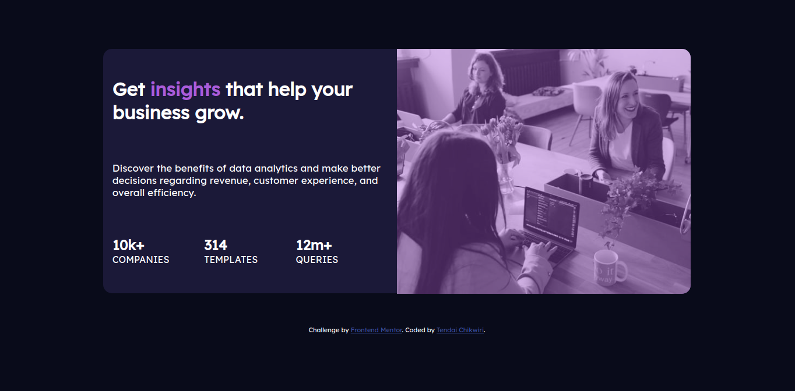

# Frontend Mentor - Stats preview card component solution

This is a solution to the [Stats preview card component challenge on Frontend Mentor](https://www.frontendmentor.io/challenges/stats-preview-card-component-8JqbgoU62). Frontend Mentor challenges help you improve your coding skills by building realistic projects. 

## Table of contents

- [Overview](#overview)
  - [The challenge](#the-challenge)
  - [Screenshot](#screenshot)
  - [Links](#links)
- [My process](#my-process)
  - [Built with](#built-with)
  - [What I learned](#what-i-learned)
  - [Continued development](#continued-development)
  - [Useful resources](#useful-resources)
- [Author](#author)

## Overview

### The challenge

Users should be able to:

- View the optimal layout depending on their device's screen size

### Screenshot
### Desktop

### Mobile

### Links

- Solution URL: [Solution Code](https://github.com/TendaiChikwiri/Stats-Preview-Card)
- Live Site URL: <a href="https://tendaichikwiri.github.io/Stats-Preview-Card/" target="_blank">Live Link</a>
## My process

### Built with

- HTML5
- CSS - including Flexbox & CSS Grid

### Continued development

My main focus is to practice and imporve my UI/UX design skills

## Author

- Github - [TendaiChikwiri](https://github.com/TendaiChikwiri)
- Frontend Mentor - [@TendaiChikwiri](https://www.frontendmentor.io/profile/TendaiChikwiri)

